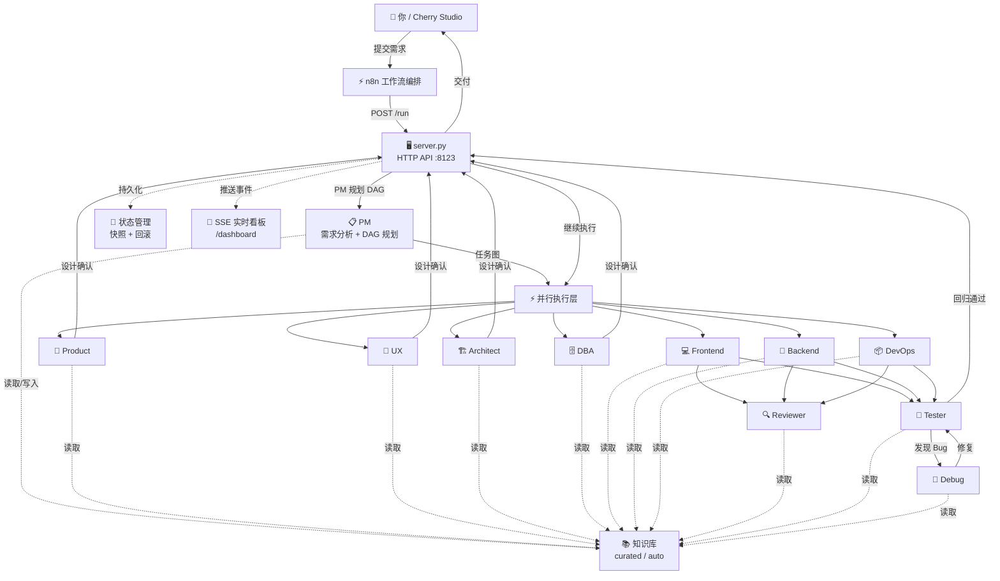
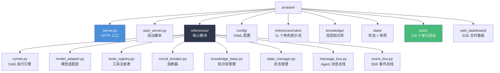
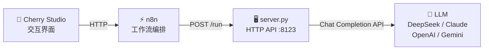

# AI-Team

**11 角色 Multi-Agent 软件开发框架**

把一整套软件开发团队塞进 LLM——提交需求，自动产出代码、测试、文档。

## 一句话

> 你提需求，AI 团队干活。PM 拆任务 → 11 个角色并行干活 → 自动修复 Bug → 交付成果。

## 团队角色

| 角色 | 干什么 |
|------|--------|
| **PM** | 拆任务、画 DAG、整合交付物 |
| **Product** | 写用户故事、定验收标准 |
| **Architect** | 系统设计、接口约定、技术选型 |
| **UX** | 用户旅程、交互设计、UI 风格建议 |
| **DBA** | Schema 设计、Migration、查询优化 |
| **Frontend** | 前端实现 + 单元测试 |
| **Backend** | API 实现 + 单元测试 |
| **Reviewer** | 代码审查、安全扫描 |
| **DevOps** | 部署配置、CI/CD |
| **Debug** | 根因分析、Bug 修复 |
| **Tester** | 集成测试、验收测试、回归验证 |

## 架构



## 项目结构



## 核心特性

- **DAG 并行执行**：PM 自动规划依赖图，无依赖的任务同时跑
- **自愈循环**：Tester 发现 Bug → Debug 修复 → Tester 回归（最多 3 轮）
- **人工审批**：关键节点（设计确认、发布确认）暂停等人拍板
- **知识库**：curated/auto 双层隔离，Agent 生成的内容标注"待审查"
- **SSE 实时看板**：浏览器打开 `/dashboard` 能看到执行过程直播
- **多模型切换**：DeepSeek / Claude / OpenAI / Gemini，改一行配置就行
- **熔断保护**：API 连续失败自动熔断，不烧 Token

## 技术亮点

- **DAG 拓扑并行调度**：PM 输出有向无环图，引擎按层级拓扑排序，同层无依赖任务 `asyncio.gather()` 真并行
- **Provider-Agnostic 模型适配层**：统一接口兼容 OpenAI / Anthropic / Google / DeepSeek 的 tool_calling 格式差异，切换模型改一行配置
- **Text-Level Tool Calling 兼容层**：对 DeepSeek 等 tool calling 弱的模型，自动从纯文本回复中正则解析 `<invoke>` 格式工具调用，回填合成 tool_calls，无需模型原生支持
- **Dynamic Tool Loadout**：根据任务描述关键词（"部署"→bash、"搜索"→web_search）动态筛选角色可用工具集，减少无效 tool_use
- **Agent 消息总线**：角色间通过 message_bus 异步通信，下游自动读取上游输出作为输入，支持 sub_request 动态委派
- **两阶段人工审批协议**：`_approval_ack.json` 确认感知 → `_approval_response.json` 决策投票，配合 3600s 超时熔断，兼顾安全与可用性
- **双层知识库 + 审查晋升机制**：curated/ 人工编写 100% 信任，auto/ Agent 自动生成标注"待审查"，审查后 `promote_to_curated()` 晋升，防 Agent 幻觉污染
- **滑动窗口熔断器**：基于 `collections.deque` + 时间窗口计数，超阈值写 `.flag` 文件持久化，30 分钟自动恢复，防止 API 故障时无限烧 Token

## 快速启动

```bash
git clone <repo>
cd ai-team
pip install -r requirements.txt
export DEEPSEEK_API_KEY="sk-..."
python start_server.py
```

然后 `POST /run` 提交你的开发需求。

## 状态管理

自动快照 + 支持回滚。跑砸了？`rollback_to_snap('last')` 回到上一刻。

## 技术栈



无需 K8s、Kafka、Grafana。一个 Python 进程跑完。
