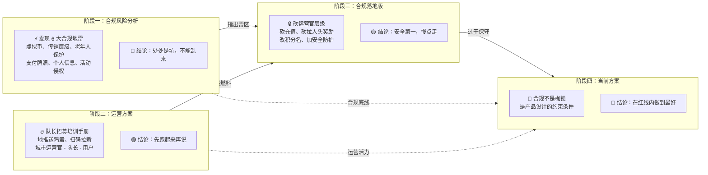
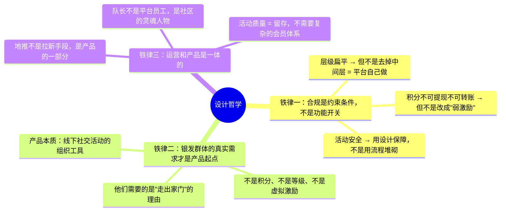
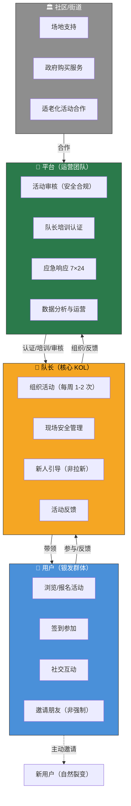
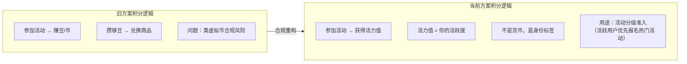
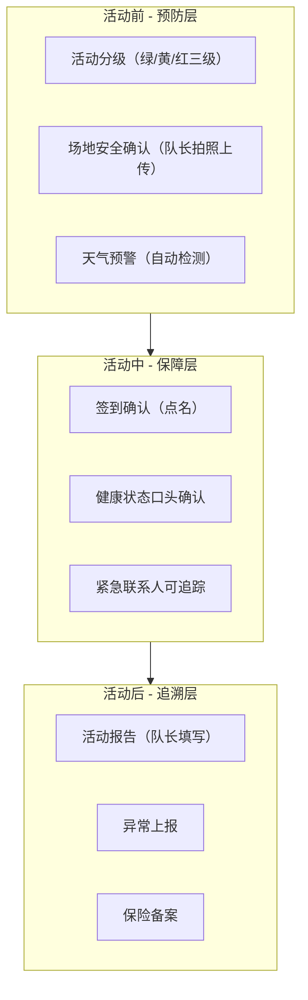
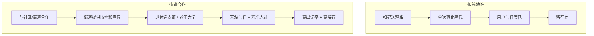
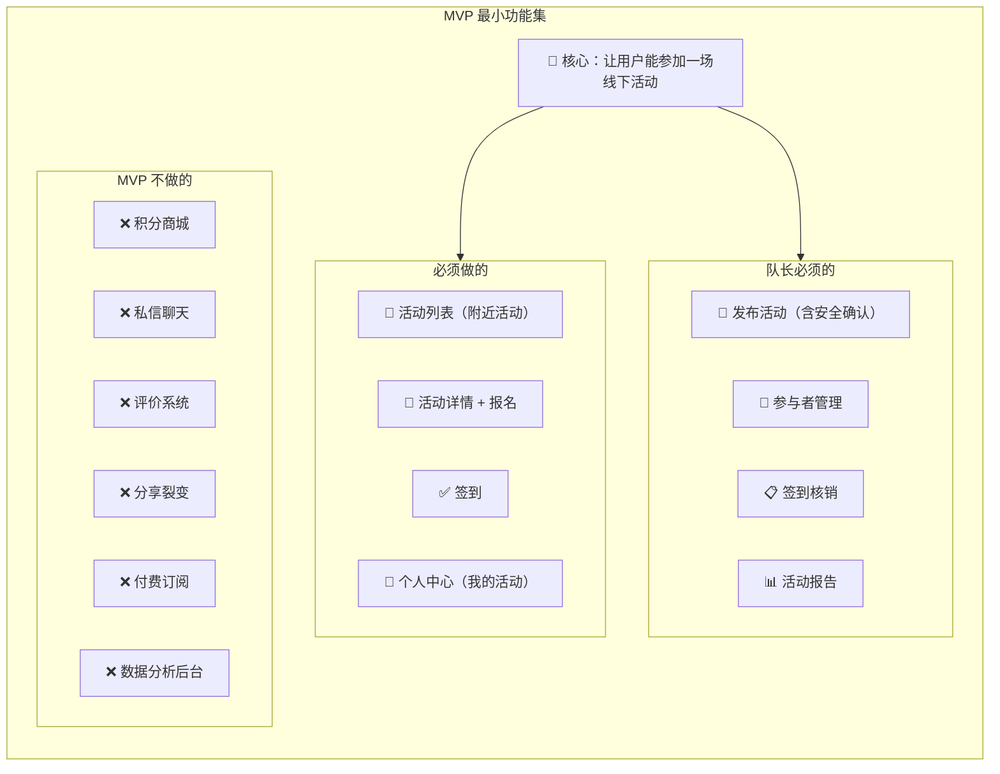

# 银发活力平台 设计理念

> 银发活力平台的设计从合规分析出发，历经多轮迭代，最终形成一套既安全可行又能真正满足银发群体需求的方案。

---

## 一、设计进化逻辑

---

## 二、核心设计哲学 — 三条铁律

---

## 三、角色关系 — 扁平化设计

> **关键差异**：早期方案砍掉了"城市运营官"层级但把运营工作全推给平台自己做。当前方案认为更好的方式是**与社区/街道合作**——他们是天然的"运营官"，有场地、有人脉、有公信力，且不存在传销层级问题。

---

## 四、积分体系 — 从"激励"到"仪式感"

### 积分设计要点

| 维度 | 合规版 | 当前方案（更好） |
|------|--------|-----------------|
| 名称 | 活力积分 | **活力值**（彻底去"币/积分"化） |
| 获取 | 签到得20、邀请得20 | **仅通过参加活动获得**（参加1次=10活力值） |
| 消耗 | 参加活动消耗15-20 | **不消耗**（活力值是累计的，不是消耗品） |
| 用途 | 兑换礼品 | **活动分级准入 + 荣誉标识** |
| 邀请奖励 | 一次性20积分，月限5次 | **不设邀请奖励**（不做裂变，做口碑） |
| 充值 | 始终不做 | 始终不做 |
| 本质 | 弱化版的虚拟币 | **不是货币，是活跃度指标** |

> **核心转变**：合规版只是把"虚拟币"改名叫"积分"，本质上还是"赚-花"的货币逻辑。当前方案彻底跳出这个框架——活力值不是钱，是你参与了多少活动的**证明**。

---

## 五、活动安全 — 三层防护 vs 流程堆砌

### 安全设计的三个原则

1. **不做"填表式安全"** — 紧急联系人不只是填个号码，而是系统发短信确认+活动前自动提醒
2. **活动分级是动态的** — 同一类型的活动在不同天气/场地条件下自动升降级
3. **安全是体验的一部分** — 不是弹窗、不是勾选框，而是让用户感觉"被照顾到了"

---

## 六、冷启动 — 街道模式 vs 地推模式

| 维度 | 传统地推 | 街道合作模式 |
|------|---------|-------------|
| 信任基础 | 低（陌生地推） | **高（街道公信力背书）** |
| 用户精准度 | 低（扫街） | **高（退休人群集中）** |
| 单次获客成本 | 5-10元（礼品+人力） | **接近于 0（街道合作）** |
| 留存率 | <20% | **> 60%（熟人社区）** |
| 规模化路径 | 铺更多街道 | **复制街道合作模式** |

---

## 七、MVP 功能树 — 做减法不做加法

---

## 八、一句话总结

> **合规分析告诉你别踩雷，运营方案告诉你往前冲。当前方案告诉你：知道雷在哪，才能放心地跑。**
