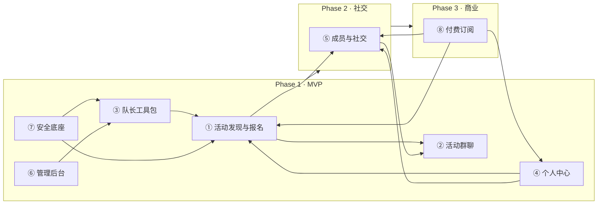

# 银发活力平台 — 功能块规划（参考 Meet5）

> 面向 40-70 岁中老年人的线下活动社交平台。参考欧洲排名第一的中老年社交 App **Meet5**（250 万用户，月均 4 万场活动），结合中国银发群体的实际需求和合规约束，规划功能模块。

---

## 一、Meet5 功能块对标分析

| Meet5 模块 | 核心功能 | 银发平台对标策略 |
|:----------:|----------|:----------------:|
| **Activities** | 浏览附近活动、筛选搜索、报名参加 | ✅ **完全保留**，银发版核心功能 |
| **For You** | 个性化推荐、已报名/已收藏/历史活动 | ✅ **简化版**，以"我的活动"为主 |
| **Members** | 浏览成员、谁看过我（付费功能） | ⚠️ **弱化**，以活动参与为社交入口 |
| **Chat** | 活动群聊 + Premium 私信 | ✅ **群聊必须有**，私信延后 |
| **Profile** | 个人资料、设置、订阅管理 | ✅ **基础版 MVP 做** |

**Meet5 运营支撑体系：**

| 运营模块 | 说明 | 银发平台策略 |
|:--------:|------|:------------:|
| **社区队长 (Captain)** | 1250+ 队长，月组织数万场活动 | ✅ **核心角色**，必须做 |
| **活动审核 & 安全** | 活动分级、参与者验证 | ✅ **加强做**，银发群体安全要求更高 |
| **Premium 订阅** | 150€/年，付费率 12% | 🟢 **三期做**，先积累用户再变现 |

---

## 二、功能块总览（5 大用户模块 + 3 大支撑模块）

| # | 功能块 | 优先级 | 阶段 | 一句话描述 |
|:-:|:------:|:------:|:----:|-----------|
| ① | **活动发现与报名** | 🔴 P0 | MVP | 银发版的核心——让用户能看到、找到、报名活动 |
| ② | **活动群聊** | 🔴 P0 | MVP | 活动前后的沟通工具，替代私信降低社交焦虑 |
| ③ | **队长工具包** | 🔴 P0 | MVP | 发布活动、签到核销、活动报告，队长的必备工具 |
| ④ | **个人中心** | 🟡 P1 | MVP | 我的活动、基础资料、紧急联系人设置 |
| ⑤ | **成员与社交** | 🟢 P2 | 二期 | 浏览成员、兴趣匹配、私信（对标 Meet5 Members） |
| ⑥ | **平台管理后台** | 🟡 P1 | MVP | 活动审核、队长审核、街道合作管理、数据看板 |
| ⑦ | **安全底座** | 🔴 P0 | MVP | 贯穿所有模块——紧急联系人、活动分级、保险 |
| ⑧ | **付费订阅** | 🟢 P3 | 三期 | Premium 变现（对标 Meet5 Freemium 模式） |

---

## 三、功能块详细拆解

### ① 活动发现与报名  🔴 P0 · MVP

| 子功能 | 详细说明 | 参考 Meet5 |
|--------|---------|:----------:|
| 附近活动列表 | 首页默认展示，按活动日期+距离排序，支持列表/卡片切换；适老化大字大间距 | ✅ Activities |
| 活动筛选器 | 按分类（徒步/聚餐/棋牌/唱歌/摄影/太极等）、日期范围、年龄范围筛选 | ✅ Filter |
| 活动搜索 | 关键词搜索活动标题/地点 | ✅ Search |
| 活动详情页 | 时间、地点、活动介绍、队长简介（含"已通过安全培训"标识）、参与者预览、安全等级标签（🟢/🟡/🔴） | ✅ |
| 一键报名 | 点击报名，实时显示剩余名额 | ✅ |
| 取消报名 | 活动开始前可取消，释放名额 | ✅ |
| 候补队列 | 满员后自动进入候补，有人取消时按序递补 | — |
| 活动收藏 | 感兴趣但还没决定的活动先收藏 | ✅ Save |
| 我的活动日历 | 已报名的活动按日历/列表展示 | ✅ For You |
| 签到（队长核销） | 活动现场队长扫码/点名确认参与者到场 | ✅ Check-in |
| 活动评价（简化） | 活动结束后点个表情（😊/😐/😞），不做文字评价 | — |

**适老化 UI 要求：**
- 字号 ≥ 16px，关键信息 ≥ 20px
- 按钮高度 ≥ 48px，触摸区域充足
- 高对比度配色（符合 WCAG 2.1 AA）
- 减少弹窗，信息尽量平铺展示
- 支持语音输入搜索

---

### ② 活动群聊  💬 🔴 P0 · MVP

| 子功能 | 详细说明 | 参考 Meet5 |
|--------|---------|:----------:|
| 自动建群 | 用户报名活动后自动加入该活动的群聊 | ✅ Group Chat |
| 群聊消息 | 文字消息、语音消息（适老优先语音）、表情包 | ✅ |
| 队长公告 | 队长可发置顶公告（集合地点变更、天气提醒等） | ✅ |
| 活动提醒 | 活动开始前 24h / 2h 自动推送提醒 | — |
| 群成员列表 | 查看群内参与者，点击可看简单资料 | ✅ |
| ❌ 私信 | MVP 不做，防止骚扰和社交焦虑 | 🔒 Premium |

**设计原则：**
- 群聊围绕**活动**存在，活动结束后 48h 自动转为只读归档
- 不做已读/未读，减少社交压力
- 队长可一键群发通知（替代微信群接龙）

---

### ③ 队长工具包  👤 🔴 P0 · MVP

| 子功能 | 详细说明 | 参考 Meet5 |
|--------|---------|:----------:|
| 发布活动 | 选分类 → 填信息（时间/地点/人数/描述） → 拍照上传场地 → 系统安全校验 → 提交审核/直接发布 | ✅ Create Activity |
| 活动模板 | 常用活动类型预设模板（徒步/聚餐/棋牌等），减少重复填写 | — |
| 参与者管理 | 查看已报名列表、满员自动关闭报名 | ✅ |
| 签到核销 | 现场扫码签到/点名签到 | ✅ |
| 活动报告 | 模板化填写（实到人数、异常情况、现场照片），减少打字负担 | ✅ |
| 场地拍照确认 | 发布时拍照上传场地，平台审核场地合规性 | — |
| 队长认证申请 | 线上申请 → 平台审核 → 培训 → 获得队长身份 | ✅ Captain |
| 紧急联系人查看 | 活动开始前可查看参与者紧急联系人（仅紧急情况使用） | — |

**队长画像：**
- 退休初期的低龄老人（55-65 岁），有闲、有热情
- 每周组织 1-2 次活动
- 对标 Meet5 社区队长：平台提供工具+品牌背书，队长本地化执行

---

### ④ 个人中心  🟡 P1 · MVP

| 子功能 | 详细说明 | 参考 Meet5 |
|--------|---------|:----------:|
| 个人资料 | 头像、昵称、年龄、兴趣标签（太极/徒步/摄影/棋牌等） | ✅ Profile |
| 紧急联系人 | 姓名 + 电话，系统发短信确认；活动前自动发送提醒 | 安全特性 |
| 健康声明 | 一次性填写基础健康状况，活动前自动弹出确认 | 安全特性 |
| 我的活动 | 已报名（即将参加）/ 已参加（历史记录）/ 已收藏 | ✅ For You |
| 活力值 | 仅通过参加活动获得，只增不减，作为活跃度标识 | — |
| 我的好友 | 活动中收藏的合拍伙伴 | ✅ Favorites |
| 设置 | 字体大小（大/超大）、通知开关、隐私设置、退出登录 | ✅ Settings |
| 紧急情况功能 | 一键拨打紧急联系人 / 平台应急热线 | — |

**活力值设计要点：**
- 参加 1 次活动 = 10 活力值
- 活力值**不消耗、不兑换、不提现**
- 用途：热门活动 VIP 名额优先权 + 荣誉标识（🌱→🌿→🌳）
- 本质上不是货币，是活跃度证明

---

### ⑤ 成员与社交  👥 🟢 P2 · 二期

| 子功能 | 详细说明 | 参考 Meet5 |
|--------|---------|:----------:|
| 同城成员 | 按活跃度排序的同城成员列表，展示基础资料 | ✅ Members |
| 兴趣标签匹配 | 按共同兴趣标签推荐可能合拍的活动伙伴 | — |
| 收藏成员 | 活动中聊得来的可以收藏，方便下次一起报名 | ✅ Favorites |
| 活动好友 | 一起参加过活动的自动成为"活动好友" | ✅ Friends |
| 私信（双向同意） | 双方都同意后可私聊，防止骚扰 | 🔒 Premium（Meet5）→ 银发版开放 |
| 隐身模式 | 不希望在列表中展示时可开启隐身 | ✅ Ghost Mode |
| 谁看过我 | 查看谁浏览过我的资料 | ✅ Premium（Meet5）→ 银发版开放 |

**设计原则：**
- 社交建立在**共同活动经历**之上，不鼓励陌生人随意搭讪
- 私信默认关闭，需双方都"打招呼"才能开启
- 群聊优先于私聊——Meet5 的核心理念：先线下见面，再线上联系

---

### ⑥ 平台管理后台  📊 🟡 P1 · MVP

| 子功能 | 详细说明 |
|--------|---------|
| 活动审核 | 审核队长发布的待审批活动，检查安全合规性 |
| 队长审核 | 审核队长申请、认证培训进度管理 |
| 活动看板 | 活动总数、参与人次、活跃队长数、趋势图 |
| 用户管理 | 查看/管理用户状态、处理投诉举报 |
| 街道/社区合作管理 | 合作街道信息维护、场地管理、对接人信息 |
| 应急响应 | 异常活动上报处理、7×24 值班管理 |
| 活动分级规则配置 | 绿/黄/红分级标准配置，天气预警阈值设置 |

---

### ⑦ 安全底座  🛡️ 🔴 P0 · 贯穿全局

**三层防护体系：**

| 层级 | 阶段 | 措施 | 说明 |
|:----:|:----:|------|------|
| 🟢 预防层 | 活动前 | 活动分级制度 | 🟢绿（低风险）/ 🟡黄（中风险）/ 🔴红（高风险需额外审核） |
| | | 场地拍照确认 | 队长上传场地照片，平台审核是否符合安全要求 |
| | | 天气自动预警 | 对接天气 API，黄色活动遇恶劣天气自动降级提醒 |
| | | 自动投保 | 1 元/人/天活动意外险，系统自动完成 |
| 🟡 保障层 | 活动中 | 签到确认 | 队长现场点名签到 |
| | | 健康确认 | 系统自动弹出健康确认，无需队长手动操作 |
| | | 紧急联系人追踪 | 活动前系统自动短信提醒紧急联系人 |
| | | 一键 SOS | 用户端+队长端一键上报异常 |
| 🔴 追溯层 | 活动后 | 队长活动报告 | 模板化填写，重点报告异常情况 |
| | | 异常上报 | 活动中的意外/纠纷上报平台 |
| | | 保险备案 | 自动归档保险凭证 |

**安全设计三原则：**
1. **不做"填表式安全"** — 紧急联系人不只是填号码，系统自动发短信确认+活动前自动提醒
2. **活动分级动态化** — 同一活动在不同天气/场地条件下自动升降级
3. **安全是体验的一部分** — 不是弹窗和勾选框，而是让用户感觉"被照顾到了"

---

### ⑧ 付费订阅  💰 🟢 P3 · 三期

| 子功能 | 说明 | 参考 Meet5 |
|--------|------|:----------:|
| Premium 会员 | 月卡 / 季卡 / 年卡 | ✅ 150€/年，付费率 12% |
| 优先报名 | 热门活动无需等待直接报名 | ✅ Prioritized participation |
| 专属活动推荐 | 系统推荐精品/限定活动 | ✅ |
| 金色标识 | 个人资料金色标识，荣誉感 | ✅ Golden Profile |
| 高级筛选 | 按更多维度筛选活动 | ✅ |
| 隐身模式 | 不展示浏览记录 | ✅ Ghost Mode |
| 专属活动创建 | 可创建仅限邀请的活动 | ✅ Invite-only |

**定价参考（银发版）：**
- 月卡：¥19.9
- 季卡：¥49.9
- 年卡：¥159.0
- 对标 Meet5 约 12% 付费率

---

## 四、分阶段实施路线

### Phase 1 · MVP（第 1-2 月）

```
目标：跑通"活动发现 → 报名 → 参加 → 签到"完整闭环

功能块          包含内容
──────────────────────────────────────────────────────
① 活动发现与报名   附近活动列表、活动详情、报名/取消、签到
② 活动群聊         自动建群、群聊消息、队长公告、活动提醒
③ 队长工具包       发布活动、参与者管理、签到核销、活动报告
④ 个人中心         个人资料、紧急联系人、健康声明、我的活动
⑥ 管理后台         活动审核、队长审核、活动看板
⑦ 安全底座         活动分级、天气预警、紧急联系人、保险、SOS

技术栈：小程序 + Flask + SQLite · 1-2 人月
```

**MVP 不做清单：**
- ❌ 私信/好友系统
- ❌ 成员浏览/匹配
- ❌ 付费订阅
- ❌ 积分/虚拟币
- ❌ 详细评价系统
- ❌ 数据分析大屏

---

### Phase 2 · 社交拓展（第 3-4 月）

```
目标：建立用户之间的社交连接，增强留存

功能块          新增内容
──────────────────────────────────────────────────────
⑤ 成员与社交      同城成员、兴趣匹配、收藏成员、活动好友、私信
① 活动发现与报名   候补队列、简易活动评价（表情）
④ 个人中心         活力值体系上线、好友列表
⑥ 管理后台         街道/社区合作管理模块

其他：活动推荐算法（基于兴趣标签 + 历史参与）
```

---

### Phase 3 · 商业化（第 5-6 月）

```
目标：实现可持续营收

功能块          新增内容
──────────────────────────────────────────────────────
⑧ 付费订阅        Premium 会员体系
④ 个人中心         订阅管理、会员权益展示
① 活动发现与报名   会员专属活动/优先报名
⑥ 管理后台         付费数据看板、收入统计

其他：B2B 街道定制服务（为街道提供专属活动管理后台）
     品牌合作模块（本地商家活动合作）
```

---

## 五、功能块依赖关系图



---

## 六、与设计理念的对照

| 设计理念 | 对应功能块 | 落地方式 |
|:-------------:|:----------:|---------|
| 合规是约束条件，不是功能开关 | ⑦ 安全底座 + ④ 个人中心 | 活力值不消耗不兑换、不做虚拟币、不做多级层级 |
| 银发群体的真实需求是"走出家门" | ① 活动发现 | 以活动为第一入口，不是以社交为入口 |
| 运营和产品是一体的 | ③ 队长工具包 + ⑥ 管理后台 | 队长不是员工，是社区灵魂人物；工具赋能而非管控 |
| 不做"填表式安全" | ⑦ 安全底座 | 系统自动做天气检测、紧急联系人确认、健康确认 |
| 街道合作模式 | ⑥ 管理后台 | 街道作为合作角色接入系统，提供场地和宣传 |
| 积分去货币化 | ④ 个人中心 | 活力值只增不减、不兑换、是活跃度标识不是货币 |

---

## 七、MVP 快速启动建议

如果从零开始，建议按这个优先级推进：

```
第一周：数据库设计 + 用户认证 + 基础 UI 框架
第二周：活动发布（队长端）+ 活动列表（用户端）
第三周：报名/签到 + 活动详情
第四周：活动群聊（简易版）
第五周：安全底座（紧急联系人 + 活动分级）
第六周：个人中心 + 管理后台（基础版）
第七周：联调测试 + 适老化 UI 打磨
第八周：上线 + 第一批队长入驻
```

---

> **参考来源：** Meet5 公开资料（faq.meet5.com, meet5.com, App Store）
